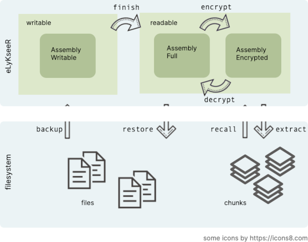

[Content](00_Content.md)

# How is this working?

This software provides functionality to backup data from local files and restore it again later.
All data are encrypted using well established and strong cryptographic standards.

As shown in the image the file data is *backup* to an assembly. Once this is full it is *finished*, then *encrypted*. Such encrypted assemblies are output in chunks to the local filesystem.
Subsequently, assemblies can be reconstructed (*recall*) from such chunks, *decrypted* using the correct cryptographic keys, and the original file data be *restored* from them.

