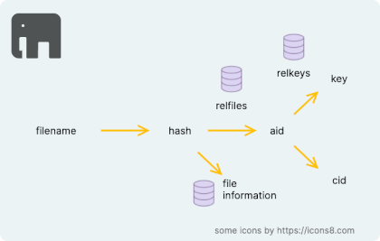

[Content](01_Content.md)

# Relations of information

The software generates a number of meta data that are stored internally in relations. This enables the restoration of the file data, and the encryption & decryption of assemblies.

As shown in the image, filenames are in relation to their computed hashes.
These hashes are in relation with the assemblies (aid = assembly identifier) in which the file content has been stored.
Assemblies are in relation with their encryption keys. And, they are linked to the chunk identifiers (cid) such to reconstruct them.

## Relation Relfiles

We record in a database the relation between the hash of a filename with the identifier of the assembly in which the file's content was added.

## Relation Relkeys

We record in a database the relation between assembly identifier and the cryptographic key which was used to encrypt the assembly.
