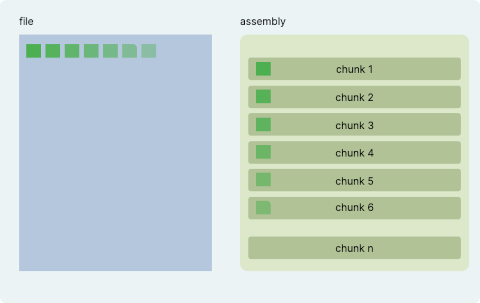

[Content](00_Content.md)

# Details about data storage

File content is copied into an assembly in a non-local way, i.e. bytes that follow each other in the original file are stored far apart in the assembly. As the assembly gets output to chunks they even end up in different chunk files on disk.

The image shows on the left a file with its content color labelled by position and on the right a schema of an assembly.
The reading order in the file is from left to right in a row oriented manner.
As the data is copied from the file, it is added to the assembly in a column oriented manner.
This means that the first datum is added to the beginning of the first chunk. The second datum is added to the beginning of the second chunk. The third datum ends up in the third chunk and so on.

In other words: adjacent bytes from the file *bi* and *bi+1* become *Bk* and *Bk+(256\*1024)* so are definitely not adjacent anymore. Their indizes are spaced apart by the size of a chunk (256*1024 bytes).
