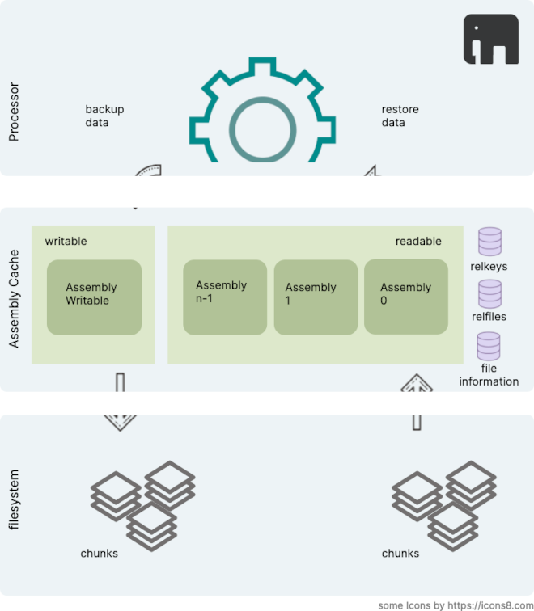

[Content](00_Content.md)

# Data caching

The module [AssemblyCache](../theories/AssemblyCache.v) maintains a fixed size cache of assemblies.

* one assembly is writeable. As soon as it is full it will get encrypted and extracted to chunks.

* a fixed number of assemblies are decrypted. Only the one in the first place is readable. If another one is requested and not yet decrypted, then it will be reconstructed from chunks, decrypted and put in front of the others. The last one is dropped.

* client processes interact with the cache to add data to it or retrieve data.
