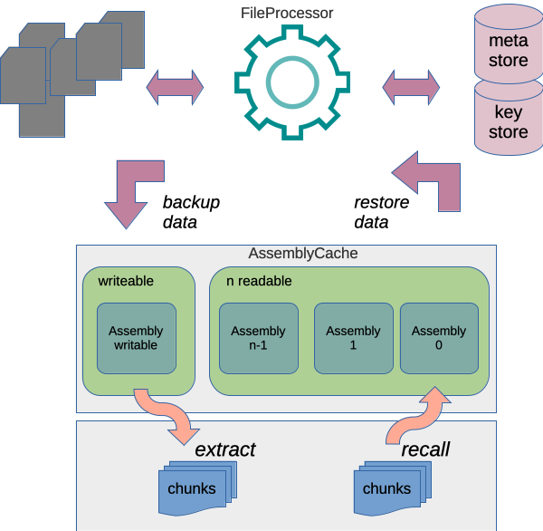

[Content](00_Content.md)

# File backup processing

The module [Processor](../theories/Processor.v) simplifies the backup process. It also uses the wrapped "C" file access functions from [Mlcpp_cstdio](https://github.com/CodiePP/ml-cpp-cstdio).



Extract from the OCaml program [lxr_processor](../bin/lxr_processor.ml) to highlight how little code is needed to implement a save backup procedure:

```OCaml
(* initial state *)
let initial_state = (Processor.prepare_processor conf, []) in
(* backup each file *)
let (proc0, fis) = List.fold_left
                        (fun (proc, fis) filename ->
                         let (fi, (_, proc')) = Processor.file_backup proc filename
                         in (proc', fi :: fis))
                        initial_state !arg_files in
(* close the processor - will extract chunks from current writable environment *)
let proc1 = Processor.close proc0 in

(* access meta data and output to irmin database *)
let%lwt () = output_relkeys proc1 in
let%lwt () = output_relfiles proc1 fis in
```
